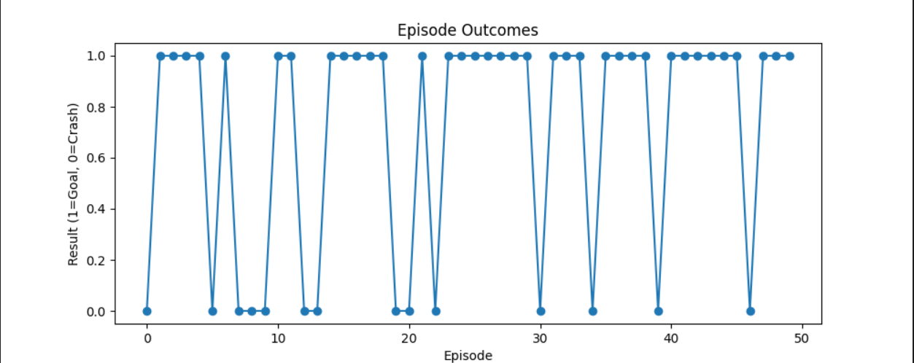

# Autonomous Maritime Navigation using Reinforcement Learning

This project demonstrates an autonomous ship navigation system trained using **Reinforcement Learning (PPO)**.  
The agent learns to navigate through a dynamic ocean environment while avoiding moving obstacles and ocean currents.

---

# Project Overview

Autonomous maritime navigation is a complex problem involving dynamic environments, unpredictable disturbances, and collision avoidance.

In this project, a **custom reinforcement learning environment** was built using **Gymnasium**, where an agent learns to navigate a ship across a grid-based ocean while:

- Avoiding moving obstacles
- Handling ocean current disturbances
- Navigating toward randomly generated goals

The agent is trained using **Proximal Policy Optimization (PPO)** implemented with **Stable-Baselines3**.

---

# Environment Design

Environment features:

- **Grid Size:** 10 × 10 ocean map
- **Agent:** Autonomous ship
- **Goal:** Reach a target location
- **Action Space:** 4 actions
  - Move Up
  - Move Down
  - Move Left
  - Move Right

### Dynamic Challenges

The environment includes several real-world inspired difficulties:

• Moving obstacles  
• Random obstacle direction changes  
• Ocean current disturbances  
• Randomized goal positions  
• Time-limited navigation episodes  

These features create a **stochastic navigation problem** rather than a fixed pathfinding task.

---

# Reinforcement Learning Algorithm

The agent is trained using:

**Proximal Policy Optimization (PPO)**

Training configuration:
Algorithm: PPO
Library: Stable-Baselines3
Policy Network: MLP
Training Steps: 4,000,000
Observation Space: 20 features
Action Space: 4 discrete actions

---

# State Representation

The agent receives a **20-dimensional observation vector** containing:

• Ship position  
• Goal position  
• Relative distance to goal  
• Obstacle positions  

All observations are **normalized between -1 and 1** for stable training.

---

# Training

Training is performed using a custom Gymnasium environment.

Example training command:

python -m training.train_agent

Training time:

~20–30 minutes on CPU

# Visualization:

The trained agent is visualized using Pygame, showing:

• Ship navigation
• Moving obstacles
• Ocean current direction

Example:

#Performance Analysis :

#Installation

Install dependencies:
pip install -r requirements.txt

Run Training:
python -m training.train_agent

Run Simulation:
python render/run_simulation.py

Technologies Used

Python
Gymnasium
Stable-Baselines3
NumPy
Pygame
Matplotlib

#Key Learning Outcomes

This project demonstrates:

• Designing custom reinforcement learning environments
• Training PPO agents in stochastic environments
• Reward shaping for navigation tasks
• Visualizing RL policies in simulation

Future Improvements

Potential extensions:

• Continuous control navigation
• Sensor-based obstacle detection
• Multi-agent maritime traffic simulation
• Deep reinforcement learning with CNN observations

Author

Sukhjeet Singh
AI / Machine Learning Enthusiast
