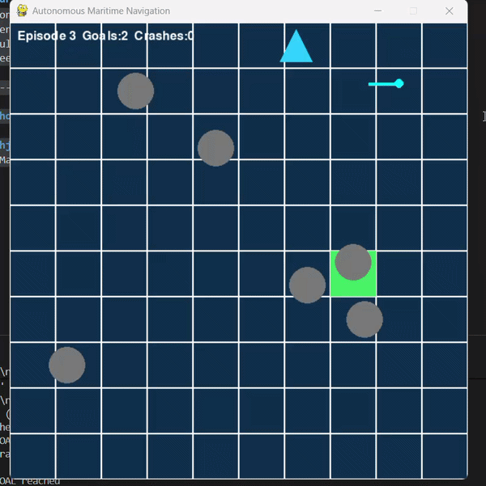
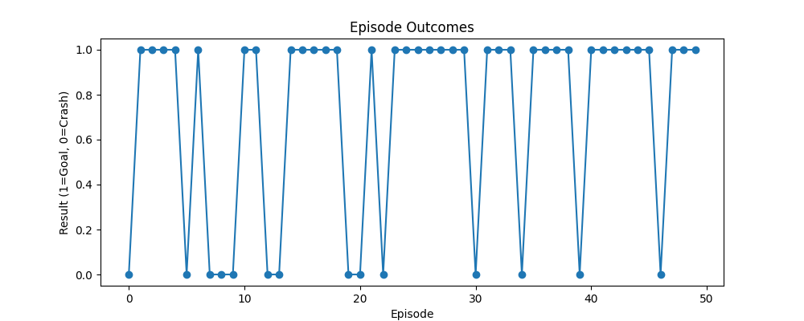
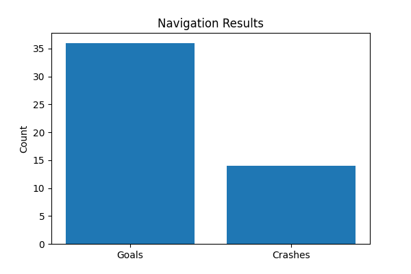
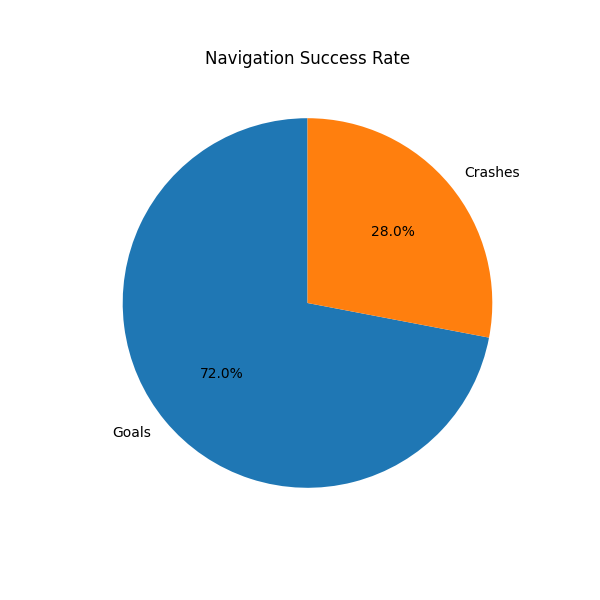

# Autonomous Maritime Navigation using Reinforcement Learning

## Simulation Demo



This project implements an **autonomous maritime navigation system using
Reinforcement Learning (PPO)**. The agent learns to navigate a ship
through a dynamic ocean environment while avoiding obstacles and
handling environmental disturbances such as ocean currents.

------------------------------------------------------------------------

# Project Overview

Autonomous maritime navigation is a complex control problem involving:

-   dynamic environments
-   obstacle avoidance
-   stochastic disturbances
-   goal-directed navigation

In this project, a **custom reinforcement learning environment** was
developed using **Gymnasium**, where an RL agent learns navigation
policies using **Proximal Policy Optimization (PPO)** from
**Stable-Baselines3**.

The agent learns to:

-   Navigate toward randomly generated targets
-   Avoid moving obstacles
-   Adapt to ocean current disturbances
-   Reach goals within limited episode steps

------------------------------------------------------------------------

# Environment Design

## Environment Features

  Feature              Description
  -------------------- -------------------------------
  Grid Size            10 × 10 ocean grid
  Agent                Autonomous ship
  Goal                 Reach target location
  Action Space         4 discrete navigation actions
  Max Episode Length   180 steps
  Obstacles            6 moving obstacles

### Available Actions

-   Move Up
-   Move Down
-   Move Left
-   Move Right

------------------------------------------------------------------------

## Dynamic Challenges

The environment simulates real-world maritime uncertainties:

-   Moving obstacles with random direction changes
-   Ocean current disturbances affecting ship movement
-   Randomized goal positions
-   Time-limited navigation episodes

These conditions create a **stochastic reinforcement learning problem**,
making the task significantly more challenging than simple pathfinding.

------------------------------------------------------------------------

# Reinforcement Learning Algorithm

The agent is trained using:

**Proximal Policy Optimization (PPO)**

### Training Configuration

  Parameter           Value
  ------------------- --------------------
  Algorithm           PPO
  Library             Stable-Baselines3
  Policy Network      MLP
  Training Steps      4,000,000
  Observation Space   20 features
  Action Space        4 discrete actions

------------------------------------------------------------------------

# State Representation

The agent receives a **20-dimensional observation vector** containing:

-   Ship position
-   Goal position
-   Relative distance to the goal
-   Obstacle positions

All observations are **normalized between -1 and 1** to stabilize
learning.

------------------------------------------------------------------------

# Reward Function

The reinforcement learning agent is trained using a shaped reward
function designed to encourage efficient navigation while avoiding
obstacles.

  Event                                     Reward
  ----------------------------------------- -------------------------------
  Step penalty                              -0.04
  Moving closer to goal                     +(distance improvement × 2.2)
  Moving away from goal                     negative distance reward
  Sailing close to obstacle (\<1.5 cells)   -0.4
  Collision with obstacle                   **-45**
  Reaching goal                             **+150**
  Episode timeout                           -8

### Reward Design Strategy

The reward function combines several learning signals:

-   **Distance-based reward shaping** encourages progress toward the
    goal
-   **Step penalty** discourages wandering behavior
-   **Obstacle proximity penalties** encourage safe navigation
-   **Large terminal rewards** reinforce successful navigation
-   **Severe collision penalties** discourage unsafe policies

This reward design helps the PPO agent learn stable navigation
strategies in a dynamic environment with moving obstacles and ocean
currents.

------------------------------------------------------------------------

# Training

Training is performed using the custom Gymnasium environment.

### Run Training

``` bash
python -m training.train_agent
```

### Training Time

Approximately **20--30 minutes on CPU**.

------------------------------------------------------------------------

# Evaluation Results

The trained agent was evaluated across **50 simulation episodes**.

  Metric              Value
  ------------------- ---------
  Episodes Tested     50
  Goal Success Rate   **72%**
  Crash Rate          **28%**

These results show the agent successfully learns navigation strategies
in a stochastic environment with dynamic obstacles and environmental
disturbances.

------------------------------------------------------------------------

# Performance Analysis

Training and evaluation results are visualized below.







------------------------------------------------------------------------

# Visualization

The trained policy can be visualized using **Pygame**.

The simulation shows:

-   ship navigation behavior
-   obstacle movement
-   ocean current disturbances

### Run Simulation

``` bash
python render/run_simulation.py
```

------------------------------------------------------------------------

# Installation

Install project dependencies:

``` bash
pip install -r requirements.txt
```

------------------------------------------------------------------------

# Technologies Used

-   **Python**
-   **Gymnasium** -- custom RL environment
-   **Stable-Baselines3** -- reinforcement learning algorithms
-   **NumPy** -- numerical computations
-   **Pygame** -- simulation visualization
-   **Matplotlib** -- training metrics visualization

------------------------------------------------------------------------

# Key Learning Outcomes

This project demonstrates:

-   Designing **custom reinforcement learning environments**
-   Training **PPO agents in stochastic environments**
-   Implementing **reward shaping for navigation tasks**
-   Visualizing reinforcement learning behavior in simulation
-   Evaluating RL agent performance using simulation metrics

------------------------------------------------------------------------

# Future Improvements

Possible future extensions include:

-   Continuous control navigation
-   Sensor-based obstacle detection
-   Multi-agent maritime traffic simulation
-   Deep reinforcement learning with CNN-based observations
-   Realistic maritime navigation physics

------------------------------------------------------------------------

# Author

**Sukhjeet Singh**

AI / Machine Learning Enthusiast
